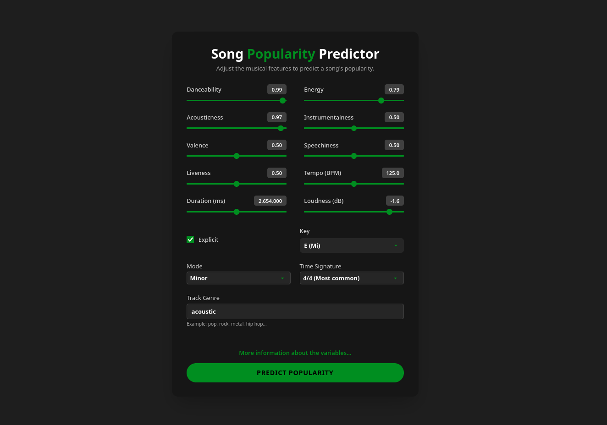
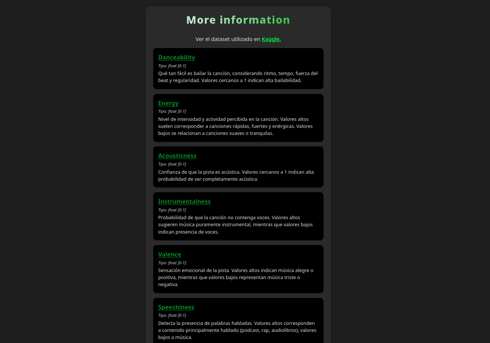

# 🎵 Popularity Prediction Dashboard

Este proyecto corresponde al dashboard del sistema de predicción de popularidad de canciones.

Está compuesto por dos servicios:

- **Frontend:** Dashboard desarrollado en Vue.
- **Backend:** API en FastAPI que expone los datos y las predicciones.

---

## 📑 Contenido

- [🎵 Popularity Prediction Dashboard](#-popularity-prediction-dashboard)
  - [📑 Contenido](#-contenido)
  - [Requisitos previos](#requisitos-previos)
  - [Configuración Inicial](#configuración-inicial)
  - [Ejecución de la aplicación con Docker](#ejecución-de-la-aplicación-con-docker)
  - [Ejecución de la aplicación con Makefile](#ejecución-de-la-aplicación-con-makefile)
  - [Pantallas del dashboard](#pantallas-del-dashboard)
    - [1. Input Screen](#1-input-screen)
    - [2. Info Screen](#2-info-screen)
    - [3. Result Screen](#3-result-screen)

---

## Requisitos previos

Antes de ejecutar la aplicación debe de tener instalado:

1. [Docker](https://docs.docker.com/get-started/get-docker/)
2. [Docker Compose](https://docs.docker.com/compose/)

Verificar que estén disponibles en el equipo:

```
docker --version
```

```
docker compose version
```

## Configuración Inicial

Clonar el repositorio y entrar en la carpeta del dashboard:

```
git clone https://github.com/JoseDanielGar/Popularity_Prediction.git
```

```
cd Popularity_Prediction/dashboard
```

## Ejecución de la aplicación con Docker

Para construir y levantar los servicios en segundo plano:

```
docker compose up --build -d
```

Esto crea y levanta dos contenedores:

- dashboard-frontend-1: disponible en http://localhost:5173
- dashboard-backend-1: disponible en http://localhost:8000/docs

Para ver las imágenes y contenedores:

```
docker images
```

```
docker ps
```

Para seguir los logs de un servicio en ejecución:

- Frontend:

```
docker compose logs -f frontend
```

- Backend:

```
docker compose logs -f backend
```

Para detener y eliminar los contenedores, redes y volúmenes creados:

```
docker compose stop
docker compose down -v
```

Si desea eliminar las imágenes:

```
docker stop <image_id>
docker rmi <image_id>
```

## Ejecución de la aplicación con Makefile

Si lo desea puede utilizar el archivo Makefile, desde la terminal en la carpeta del dashboard:

1. Levantar servicios:

```
make up
```

2. Detener servicios:

```
make stop
```

3. Ver logs del backend:

```
make logs-backend
```

4. Reiniciar todo:

```
make restart
```

## Pantallas del dashboard

### 1. Input Screen

Esta pantalla permite ingresar las características de la canción: ajusta sliders para atributos numéricos, selecciona opciones categóricas y especifica el género. Presiona Predict Popularity para obtener la predicción. También se puede acceder a más información sobre las variables con el botón More information about the variables....



### 2. Info Screen

Esta pantalla ofrece una descripción detallada de cada variable usada por el modelo y su tipo de dato. Incluye un enlace al dataset original de Kaggle para referencia.



### 3. Result Screen

Esta pantalla muestra los resultados de la predicción de la canción (Low, Medium, High) y una tabla con las características más relevantes en la predicción. Permite volver a probar con otra canción.


